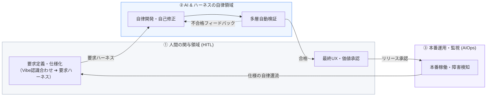

# 理想のAI駆動開発プロセス（To-Be）マップ
## 〜一本のデータ・パイプラインとHuman-on-the-Loopの境界定義〜

本ドキュメントは、AI駆動開発（AI-DLC / Spec-Driven Development）における「理想のプロセス（To-Be）」の全体像を視覚化し、各ステップの定義を整理したものです。また、理想状態に対する「現状（As-Is）とのギャップ」を書き出せるエリアを設けており、組織ごとのギャップ分析や移行計画（ロードマップ）の策定に活用できます。

---

## 1. 理想のAI駆動開発プロセス全体図（To-Be）

以下のダイアグラムは、人間（HITL）、AIエージェント、および検証・実行インフラ（ハーネス）の3つのレイヤーがどのようにシームレスに直結し、自律還流するかを示しています。

---

## 2. 各プロセスの理想定義とギャップ分析

理想的なプロセスの一連の流れについて、To-Beを実現するための「コンテキスト（インプットデータ）」「AI駆動により生まれるデータ（AI for IT）」「役割・人材ロール（人間とAIの境界）」を整理したマトリクス（表）を提示します。

それぞれのプロセスの下にある「現状（As-Is）とのギャップ」は、議論や分析の書き込み用スペースです。

---

### プロセス ①：要求定義（Vibe認識合わせ ➔ 要求ハーネスによる仕様化）

*   **概要**: ビジネス要求やUSMを出発点とし、まずVibe（迅速なモック構築や対話）を用いて関係者およびAIとの「認識合わせ」を行います。合意した認識をもとに、AIが論理的かつ厳密に解釈・検証できる「実行可能な仕様（要求ハーネス）」へと段階的に落とし込みます。

| 区分 | 定義要素 | 主な内容・具体例 |
| :--- | :--- | :--- |
| **人材ロール** | **仕様（要求）アーキテクト**（発注側/開発側の協調） | ビジネス要求を正しく整理し、AIとVibe対話（モデリング）ができる設計人材 |
| **人間（HITL）の役割** | 境界の規定・意味定義 | USMの提示、Vibeプロトタイプを元にした画面・業務ロジックの認識合わせと最終仕様の承認 |
| **AIの役割** | 整合性監査・構造化 | モックの自律生成、モックコードからの仕様抽出、論理矛盾の検証とハーネス設計 |
| **コンテキスト（入力データ）** | ビジネスインプット | **ビジネス要求（目的）、USM (User Story Map)**、既存データスキーマ、用語集 |
| **AI for ITデータ（生成データ）** | 実行可能仕様アセット | **AI抽出仕様書（Markdown）、Given-When-Then（要求ハーネス）、APIスキーマ仕様書** |

#### 🔍 現状（As-Is）とのギャップ（記入エリア）
> *（例：仕様書が日本語のExcelやPowerPointで書かれており、記述の粒度がバラバラ。AIがそのまま解釈できず、手動でプロンプト化する必要がある、など）*
> 
> *   
> *   

---

### プロセス ②：AIエージェントによるコード自律生成と自己修正

*   **概要**: AIエージェントが確定した仕様書と要求ハーネスを読み込み、人間が手を動かすことなく、実装コードと単体テストコードを自律生成し、合格するまで自己修正します。

| 区分 | 定義要素 | 主な内容・具体例 |
| :--- | :--- | :--- |
| **人材ロール** | **AIオーケストレーター**（開発側） | AIに正しい開発文脈と実行環境を提供し、自律開発を指示・監督する人材 |
| **人間（HITL）の役割** | 開発コンテキストの整備 | 開発環境ハーネス（Linter/Buildツール等）の整備、AIが解決不能な論理衝突時の意思決定 |
| **AIの役割** | 自律コード生成・自己修復 | クリーンコード・自動テストコードの自律生成、コンパイラ出力を元にした自律デバッグ |
| **コンテキスト（入力データ）** | 設計・仕様インプット | 要求ハーネス（仕様書、BDD）、既存コードのコンテキスト情報、システム定義 |
| **AI for ITデータ（生成データ）** | 開発ライフサイクルメタデータ | **自己修復の思考トレースログ、自動生成された単体テスト、ソースコードの依存関係マップ** |

#### 🔍 現状（As-Is）とのギャップ（記入エリア）
> *（例：AIに指示を出しても、既存コードの依存関係を破壊したり、無限ループで自己修復に失敗したりする。AIが安全に自己修正できるサンドボックス型ローカル開発環境が整備されていない、など）*
> 
> *   
> *   

---

### プロセス ③：多層自動検証ゲート（CI/CD検証ハーネス）

*   **概要**: コミットされた成果物に対し、人間の目視レビューに頼らず、機械的に品質・セキュリティ・仕様適合性を多層的に自動検証します。

| 区分 | 定義要素 | 主な内容・具体例 |
| :--- | :--- | :--- |
| **人材ロール** | **ハーネスエンジニア**（開発側） | CI/CD検証ルールやセキュリティチェック等の安全網（ハーネス）を設計する人材 |
| **人間（HITL）の役割** | 検証ルールの策定・管理 | セキュリティ脆弱性スキャンルール、コード品質基準、パフォーマンスしきい値の設計 |
| **AIの役割** | 自動実行・検証・不合格フィードバック | CI/CDのトリガー、品質・セキュリティテストの実行、不合格時のエラー箇所・修復案特定 |
| **コンテキスト（入力データ）** | 検証ルール・ポリシー | セキュリティルール、リンター設定、インフラ検証ポリシー（IaC定義） |
| **AI for ITデータ（生成データ）** | 品質・監査データ | **自動セキュリティ脆弱性診断レポート、テストカバレッジ履歴、コード品質メトリクスデータ** |

#### 🔍 現状（As-Is）とのギャップ（記入エリア）
> *（例：ビルドやセキュリティスキャンが手動実行、もしくは検証ルールが形骸化している。CIで自動テストを回す文化がなく、手動の結合テストや検収工程が主になっている、など）*
> 
> *   
> *   

---

### プロセス ④：検証用サンドボックス実行と人間による最終UX・デモ承認

*   **概要**: 自動検証をパスしたシステムをステージング/サンドボックス環境に自動配備し、人間が実際の挙動やUX、ビジネス価値の適合性を最終確認します。

| 区分 | 定義要素 | 主な内容・具体例 |
| :--- | :--- | :--- |
| **人材ロール** | **プロダクトオーナー（PO） / ビジネス担当者**（発注側） | UX価値やビジネス要件の適合性を評価する意思決定者 |
| **人間（HITL）の役割** | UX/ビジネス価値の最終承認 | サンドボックス環境での操作感の評価、最終UXおよび価値の適合性承認、本番トリガー |
| **AIの役割** | サンドボックス構築・デモ準備 | 隔離されたコンテナ環境の自動構築、モックデータの自動投入、動作デモURLの提示 |
| **コンテキスト（入力データ）** | 検証アセット・基準 | 検証合格アセット、UX検証シナリオ、ビジネス受け入れ基準 |
| **AI for ITデータ（生成データ）** | 承認・デモ実績データ | **人間からのUX改善フィードバックコメント、動作デモ実行ログ、環境デプロイ検証データ** |

#### 🔍 現状（As-Is）とのギャップ（記入エリア）
> *（例：デモ環境へのデプロイが自動化されておらず、環境構築に数日かかる。または、承認基準が「プログラムコードの行ごとの目視チェック」になっており、人間がボトルネックになっている、など）*
> 
> *   
> *   

---

### プロセス ⑤：本番運用監視と自律修復・還流ループ（AIOps）

*   **概要**: 本番環境でのシステムの稼働状況やエラーログ、ユーザー挙動を常時監視し、障害検知時にはAIが原因を自動特定・修復パッチと仕様の更新案を作成して人間に提示します。

| 区分 | 定義要素 | 主な内容・具体例 |
| :--- | :--- | :--- |
| **人材ロール** | **AIOps運用管理者 / 仕様アーキテクト** | 本番稼働監視および仕様の更新・修復を監督する人材 |
| **人間（HITL）の役割** | 修正案・仕様パッチの最終承認 | AIが提示した障害分析および要求仕様（要求ハーネス）の修正・適用パッチの最終承認 |
| **AIの役割** | 障害監視・原因分析・修復パッチ生成 | アラート検知、コールスタック分析、障害を解決するための「仕様＆コード修正案」の自律作成 |
| **コンテキスト（入力データ）** | 本番稼働コンテキスト | アプリケーションログ、システムテレメトリ（メトリクス）、セキュリティインシデントデータ |
| **AI for ITデータ（生成データ）** | 自律修復・進化データ | **AIによる障害原因分析（RCA）レポート、自律生成された仕様・コード修正パッチ案** |

#### 🔍 現状（As-Is）とのギャップ（記入エリア）
> *（例：本番障害の検知とアラートは上がるが、原因分析やコード修正はすべて人間が夜間等に手作業でログを追って行っている。監視データと開発環境が直結しておらず、データのパイプラインが分断されている、など）*
> 
> *   
> *   

---

## 3. AI駆動開発へのステップアップ基準（成熟度モデル）

各開発工程（要求定義、実装、検証、運用など）において、現状の「AI-Ready（準備）」から「AI-Support（補助）」へ、さらに理想である「AI-Driven（駆動）」へステップアップするための指標と、移行を阻む壁を突破するための決定的な「エッセンス（移行の鍵）」を以下に整理します。

### 成熟度レベルの対比マトリクス

| 成熟度レベル | 開発プロセスの状態 | 決定的なエッセンス（移行の鍵） | 移行を阻む「見えない壁」 |
| :--- | :--- | :--- | :--- |
| **レベル 1 AI-Ready （準備期）** | 要件、設計、システム構造が**「AIが解釈可能な状態に構造化されている」**状態。 ・暗黙知の明文化 ・API境界やスキーマの定義 ・基本の自動テストの存在 | **【データの構造化・言語化の規律】** 人間同士の「空気の読み合い」や曖昧な指示を廃し、Given-When-Thenなどの機械可読な構造化テキスト（要求ハーネス）でシステム境界を表現しきる規律。 | **「Excel/自然言語の罠」** 曖昧な日本語仕様書や図面・ポンチ絵での丸投げが常態化しており、AIに与える前提コンテキストが整備されていない壁。 |
| **レベル 2 AI-Support （補助期）** | AIがコード補完やテスト生成などを支援し、人間がコードをレビューする **HITL (Human-in-the-Loop)** 状態。 ・プロンプトエンジニアリングの活用 ・個人の局所的な記述速度の向上 | **【人間による目視レビューの限界の承認】** 人間がコードを一行ずつ読むのを諦め、コードの正当性を「自動検証テスト（検証ハーネス）」に担保させるテスト駆動開発（TDD/BDD）へのシフト。 | **「コードレビューの渋滞（認知限界）」** AIの記述速度に人間のレビュー速度が追いつかず、結合や確認のフェーズで人間が最大のボトルネックになってしまう壁。 |
| **レベル 3 AI-Driven （自律期）** | 人間は仕様（要求ハーネス）を定義し、AIエージェントがコード・テストの実装と自己修正を自律実行する **HITL (Human-on-the-Loop)** 状態。 ・一本のデータ・パイプライン ・運用監視から仕様への自律還流 | **【ハーネスエンジニアリングと一本のパイプライン化】** 要求 ➔ 実装 ➔ 検証 ➔ デプロイ ➔ 監視が手動の転記なく直結し、本番の障害や変更をAIが分析して仕様（要求ハーネス）へ自律還流する仕組みの構築。 | **「手動プロセスの残存と信頼不足」** 工程間に「Excelへの転記」「人手によるデプロイ作業」が残り、AIの自律稼働と自動テストの監査を完全に信頼しきれない壁。 |

### ステップアップのための実践的アクション

1.  **レベル1 ➔ レベル2 へのステップアップ**
    *   **アクション**: 曖昧な日本語で「こういう機能を作って」と指示するのをやめ、**「User Story Map (USM)」から要求の振る舞い（Given-When-Then）を抽出し、AIに与えるコンテキストファイルとして明文化**する習慣をチームで徹底する。
2.  **レベル2 ➔ レベル3 へのステップアップ**
    *   **アクション**: 人間がコードの「手書き」や「コードの文字校正レビュー」から退き、**「要求ハーネス（受け入れ基準テスト）」の設計に専念**する。CI/CDパイプラインに、セキュリティ、品質、実行サンドボックス等の**「多層自動検証（検証ハーネス）」を常時配備**し、人間がレビューする行為をシステム的に自動化する。

---

## 4. 今後の進め方：ギャップの特定とロードマップ化

理想のプロセスマップをベースに、以下の手順でAI駆動開発組織への移行を進めます。

1.  **ワークショップによるギャップ（As-Is）の書き出し**
    *   プロジェクト関係者（ビジネス部門、仕様アーキテクト、開発パートナー）で本ドキュメントを共有し、各ステップの「🔍 現状（As-Is）とのギャップ」欄にリアルな課題を抽出して書き込みます。
2.  **ボトルネックの優先順位付け**
    *   「データ・パイプラインが最も激しく分断されている場所（手動でのデータ転記やExcel調整が発生している箇所）」を特定し、改善の優先度を決定します。
3.  **ハーネスインフラの段階的整備**
    *   一足飛びに完全自律ループを目指すのではなく、まずは「プロセス①の要求ハーネス（実行可能仕様）の書き方の統一」や「プロセス③の多層自動検証ゲートの整備」など、AIを安全に制御するための土台（Harness Engineering）から着手します。
