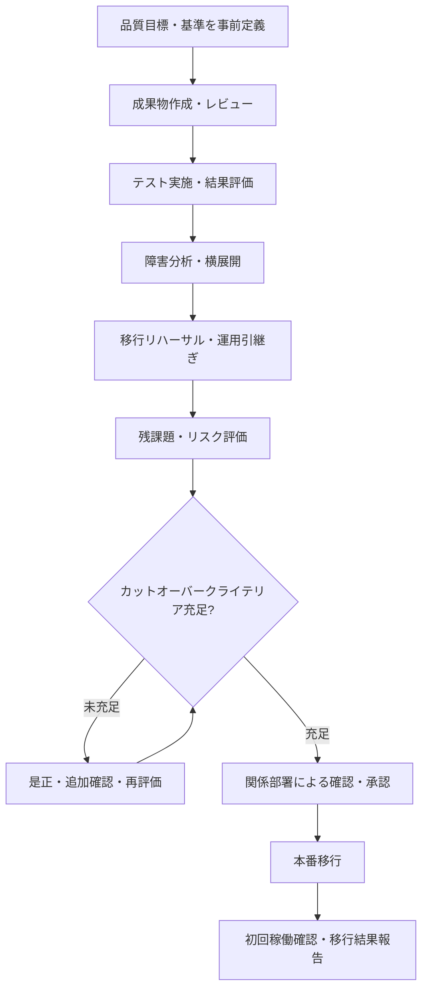

# プロジェクトリリース時の品質評価・品質保証

## 1. 目的

本資料は、プロジェクトのリリースにあたり、以下を明確にすることを目的とする。

- どのような項目を達成する必要があるか
- どの部署・役割が関係するか
- 具体的に何ができれば「品質保証ができた」といえるか

---

## 2. 結論

プロジェクトリリース時の品質保証とは、単に「テストが完了した」「障害がゼロになった」という状態だけを指すものではない。

次の状態を、客観的な証跡に基づいて関係部署が確認し、本番移行可能と判断できることが重要である。

> 計画時に定めた品質目標、品質基準およびカットオーバークライテリアを満たし、レビュー・テスト・移行リハーサル等の結果が記録されていること。残課題や例外がある場合も、その影響、リスク、対応策、期限、責任者等が明確で、関係部署が本番移行可能と判断できる状態であること。

プロジェクト管理要領では、カットオーバークライテリアに具体的な評価項目、基準、達成状況を示し、計画作業に積み残しがないこと、または積み残しがあっても本番移行・業務運営上のリスクと対応策が明らかであることを、案件承認者やユーザ部署等が判断できるようにする考え方が示されている。citeturn1search60

---

## 3. 参照すべき社内資料

### 3.1 最上位の企画・開発ルール

**資料名：A10_000_標準化 企画・開発ルール**

主要案件に関して、以下の手続が定められている。

- プロジェクト計画
- プロジェクト評価会議
- カットオーバー判定
- 本番移行
- サービスイン判定
- 初回稼働確認
- 移行結果報告
- プロジェクト完了評価
- 稼働後評価
- システム案件の品質評価・モニタリング

また、プロジェクト計画時には、総合テストや移行リハーサルの開始前に、品質評価および着手承認に関するマイルストーンを設定することが示されている。テストで品質不良が検出された場合は、テストケースの消化状況、検証完了件数、障害発生件数等を定量的に示し、品質確保方針、残課題およびリスク対応を報告することが求められる。citeturn1search50

リリース判定報告では、少なくとも次の内容が必要とされている。

- 対象案件一覧
  - 対象システム
  - 案件分類
  - リリース規模
  - リスク判定結果等
- 品質管理室による品質評価結果
  - 開発プロセス
  - 最終確認テスト結果等
- 移行・フォールバック計画
- フォールバック時の顧客影響および対応内容
- 移行タイムチャート

品質管理室は、個別リリース案件の品質・妥当性を評価し、その結果を開発担当部と共有したうえで、所定の報告を行う。citeturn1search50

### 3.2 品質管理の具体的な進め方

**資料名：A22_010_プロジェクト管理要領**

品質管理は、次の構造で整理されている。

1. 品質目標の設定
2. 品質保証方針の策定
3. レビュー計画
4. 品質評価の実施

品質目標は、システム特性・プロジェクト特性を踏まえ、プロダクトやサービスが何を実現しなければならないかを定める。品質保証方針では、成果物作成作業の品質向上と、レビュー・テストによる品質チェックの両面を検討する。citeturn1search60

品質基準や品質チェックの例として、次の事項が示されている。

- 上位文書との追跡性を確保する
- セキュリティ要件・仕様がリスク評価シートの条件を満たす
- テストやリハーサルで確認できない対象を事前に洗い出す
- 確認できない部分についてリスク軽減策を講じる
- プログラムコードをレビューする
- テストケースをレビューする
- テスト結果をレビューする
- プロダクトだけでなく、開発・管理プロセスも確認する
- 協力会社に製造・単体テストを任せきりにせず、会社側でも品質を確認する

citeturn1search60

### 3.3 成果物・ガイドの入口

**資料名：成果物編**

以下の要領・ガイドが掲載されている。

- プロジェクト計画書記載要領
- フェーズ計画書記載要領
- テスト計画文書記載要領
- 移行計画文書記載要領
- カットオーバークライテリア記載要領
- テスト計画ガイド（品質管理編）
- テスト品質評価報告ガイド
- 非機能要件項目ガイド
- 障害対処手順整備ガイド

今回の目的では、特に以下が重要である。

- **カットオーバークライテリア記載要領**
- **テスト品質評価報告ガイド**

citeturn1search58

### 3.4 証券代行SW更改の実例

**資料名：03_00_【証券代行 SW更改】総合テストフェーズ完了報告**

この資料では、レビューとテストによる品質保証が次のように整理されている。

- チーム内レビュー
- プロジェクトレビュー
- ユーザーレビュー
- チーム間をまたぐ成果物の相互レビュー
- 成果物ごとの指摘件数・指摘内容の記録と評価
- 問題がある場合の追加レビュー
- テストケース密度、バグ密度等の品質指標による評価
- 障害管理票による進捗・分析結果の管理
- 目標との乖離がある場合の品質改善策
- 指摘、障害、横展開および品質向上施策の完了確認

実績評価では、現新比較を含むテストの実施、検知したインシデントへの横展開を含む対応、災対切替手順の妥当性確認、運用管理室への引渡し、ユーザー側テスト、移行リハーサル準備および初回稼働確認一覧の整備が記録されている。citeturn1search53

### 3.5 独立した立場によるリリース判定検証の実例

**資料名：①BEST 11月リリース集約(1108(土))リリース判定評価_2線検証結果**

この実例では、次の事項を確認してリリース判定に問題がないと評価している。

- 所定のプロセスで品質管理室が確認している
- レビューチェックシートの全項目を満たしている
- 実行可能性のある移行計画が確定している
- 影響状況に応じたフォールバック計画が確定している
- 不測の事態における顧客影響・ユーザー影響を踏まえた要員体制が確立されている
- 品質評価プロセスの客観性が担保されている
- リスクが一定範囲にコントロールされている
- 初回稼働確認方針およびリスク軽減策が妥当である

1線の成果物として、リリース集約計画書、リリース判定報告書、リリース案件一覧、リリース評価報告書および案件レビューチェックシートが挙げられている。citeturn1search70

---

## 4. リリース時に達成すべき評価項目

| 評価領域 | 達成すべき状態 | 主な証跡 |
|---|---|---|
| 品質目標 | 案件特性・システム特性を踏まえた品質目標が定義されている | プロジェクト計画書、品質管理計画 |
| 要件充足 | 業務・機能・非機能要件と成果物・テスト結果との対応を確認できる | 要件定義書、対応表、テスト結果 |
| 成果物品質 | 必要成果物が作成され、標準に準拠し、所定のレビューを完了している | 成果物一覧、レビュー管理票 |
| テスト品質 | テストケースの充足性と障害状況を定量・定性の両面で評価している | テスト計画書、テスト結果報告、品質評価報告 |
| 障害管理 | 検知障害が管理され、残存障害の影響と対応方針が明確である | 障害管理票、残課題一覧 |
| 横展開 | 障害原因について類似機能・類似資産への確認を実施している | 横展開結果、追加テスト証跡 |
| 移行品質 | 移行手順、所要時間、役割、判定ポイントを確認している | 移行計画書、移行リハーサル結果 |
| フォールバック | 発動条件、戻し手順、影響および体制が確定している | フォールバック計画 |
| 運用品質 | 運用開始に必要な手順・体制を整備し、運用部署へ引き継いでいる | 運用手順書、引継ぎ記録 |
| 業務受入れ | ユーザー部署が業務面の妥当性を確認している | UAT結果、ユーザーレビュー記録 |
| リスク・残課題 | 残課題の影響、軽減策、期限、責任者および受容判断が明確である | リスク一覧、残課題一覧、承認記録 |
| 初回稼働 | リリース後の確認対象、体制、連絡およびエスカレーションを定めている | 初回稼働確認一覧、体制表 |
| 意思決定 | カットオーバークライテリアの充足を関係部署が確認・承認している | カットオーバー判定資料、議事録 |

上表は、社内標準および確認した実例を基に、リリース品質評価で確認しやすい形へ整理したものである。カットオーバー判定は、カットオーバークライテリアの充足を確認し、本番移行・運用開始が可能かを判定するイベントとして定義されている。citeturn1search50turn1search60

---

## 5. 関係部署・役割

案件により組織名や承認経路は異なるため、正式な承認部署・承認者は「案件承認・報告事項等一覧」等で確認する必要がある。以下は、確認した資料に基づく一般的な役割整理である。

| 部署・役割 | 主な責任 |
|---|---|
| システム開発部署／プロジェクト | 品質目標・品質基準の設定、成果物作成、レビュー、テスト、品質評価、カットオーバークライテリア策定 |
| PM・PL | 品質状況の評価、目標乖離時の改善判断、残課題・リスクを含むプロジェクト内の総合管理 |
| PMO・テスト統括 | 品質情報の収集・分析・モニタリングおよび報告 |
| アプリ・基盤等の各開発チーム | テスト、障害登録、原因分析、横展開および証跡整備 |
| ユーザー部署 | 業務要件・業務運営面の確認、ユーザー受入テスト、初回稼働確認、判断への参画 |
| システム企画部署 | プロジェクト計画や重要事項の確認、関係部署との連携 |
| 運用管理部署 | 運用手順、監視、障害対応および引継ぎ内容の確認 |
| 品質管理室 | 品質・妥当性の評価、品質評価結果の共有および所定の報告 |
| リスク管理部門／2線 | 品質評価プロセスの客観性、リスクコントロール、移行・フォールバック計画等の検証 |
| 案件承認者 | 品質、残課題、業務影響およびリスクを踏まえた実施判断 |

プロジェクト管理要領では、プロジェクト計画を案件承認者、ユーザー部署、システム企画部署、運用管理部署、プロジェクト内などのステークホルダーと共有し、必要な承認・確認を得ることが示されている。citeturn1search60

---

## 6. 「品質保証できた」といえる具体的な判定条件

### 6.1 品質計画

- [ ] 品質目標と評価基準を事前に定めている
- [ ] 基準値の設定根拠を説明できる
- [ ] 案件特性に応じた品質保証方針を定めている
- [ ] テスト・リハーサルで確認できない対象と、その軽減策を明確にしている

### 6.2 レビュー・成果物

- [ ] 必要な成果物を作成している
- [ ] 所定のレビューを実施し、記録を残している
- [ ] レビュー指摘の対応状況を管理している
- [ ] チーム間をまたぐ成果物について、関係者間で整合を確認している
- [ ] 要件から設計・テストまでの対応を追跡できる

### 6.3 テスト・障害

- [ ] 必要なテストを計画どおり実施している
- [ ] テストケースの充足性を説明できる
- [ ] テスト結果をレビューしている
- [ ] 障害件数だけでなく、内容・原因・傾向を分析している
- [ ] 重大障害、未解決障害および残課題の影響を説明できる
- [ ] 必要な横展開・追加確認を実施している
- [ ] 業務、機能、性能、セキュリティ、運用、災対等を案件特性に応じて確認している

### 6.4 移行・フォールバック

- [ ] 移行計画が具体化されている
- [ ] 移行リハーサルで手順、時間、体制および判定ポイントを確認している
- [ ] フォールバックの発動条件、手順および影響を明確にしている
- [ ] 不測の事態を踏まえた要員体制・連絡体制を整備している
- [ ] 顧客影響・ユーザー影響を把握している

### 6.5 運用・初回稼働

- [ ] 運用部署への引継ぎを完了している
- [ ] 必要な運用手順・障害対応手順を整備している
- [ ] 初回稼働確認の対象、体制およびエスカレーションを定めている
- [ ] ユーザー部署が業務面の妥当性を確認している

### 6.6 残課題・リスク・承認

- [ ] カットオーバークライテリアの各項目に判定結果と証跡がひも付いている
- [ ] 残課題の内容および影響が明確である
- [ ] 残課題の軽減策、期限および責任者が明確である
- [ ] 残存リスクに対する判断・承認が記録されている
- [ ] 関係部署によるレビュー、確認および承認が記録されている

---

## 7. 品質保証に関する重要な考え方

**未解決事項がゼロであることだけが、品質保証の条件ではない。**

プロジェクト管理要領では、積み残しがある場合でも、本番移行上・業務運営上のリスクと対応策が明らかであり、関係部署が本番移行可能か判断できる状態を整える考え方が示されている。citeturn1search60

残課題がある場合は、少なくとも以下を明確にする。

1. 何が残っているか
2. 本番移行・業務運営にどのような影響があるか
3. どのような軽減策を講じるか
4. 誰がいつまでに対応するか
5. どの承認・判断を得たか

一方、証券代行SW更改の実例では、計画したレビュー・テストの実施、指摘・障害への対応、横展開および運用引継ぎまでの完了が、品質確保の根拠として記録されている。citeturn1search53

---

## 8. 実務での判定イメージ

---

## 9. 推奨する確認順序

1. **A10_000_標準化 企画・開発ルール**で、案件区分、必要手続および承認・報告の全体像を確認する。citeturn1search50
2. **A22_010_プロジェクト管理要領**で、品質目標、品質保証方針、レビュー、品質評価およびカットオーバー管理の考え方を確認する。citeturn1search60
3. **成果物編**から、カットオーバークライテリア記載要領およびテスト品質評価報告ガイドを確認する。citeturn1search58
4. **証券代行SW更改の総合テストフェーズ完了報告**を、品質評価の記載例として参照する。citeturn1search53
5. **BESTの2線検証結果**を、独立した立場によるリリース判定検証の参考とする。citeturn1search70

---

## 10. 参照資料一覧

- A10_000_標準化 企画・開発ルール citeturn1search50
- A22_010_プロジェクト管理要領 citeturn1search60
- 成果物編 citeturn1search58
- 03_00_【証券代行 SW更改】総合テストフェーズ完了報告 citeturn1search53
- ①BEST 11月リリース集約(1108(土))リリース判定評価_2線検証結果 citeturn1search70
