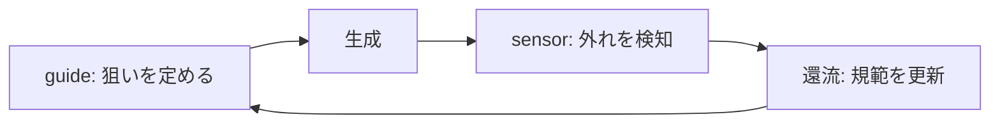

# AI成果物の品質を高める二つの観点 — guide と sensor

本書は、AIが生成するコード・文書・図表・スライド等の成果物の品質を安定させるための考え方を、guide（事前の誘導）と sensor（事後の検知）という二軸で整理したものである。個別ツールの詳細な操作手順書ではなく、何を・どの順で・どこに据えるべきかの見取り図として、広く浅く全体像を示すことを目的とする。

## 1. 本書の目的と前提

### 1.1 背景：なぜ「気合いのプロンプト」では品質が安定しないのか

AI成果物の品質のばらつきは、多くの場合AIの能力不足ではなく、狙いの伝達不足と、生成後のズレの検知不足の二つに起因する。指示者が頭の中で持っている完成イメージが言語化されないまま渡され、かつ出来上がったものが期待とどれだけ乖離しているかを誰も測っていない、という状態が典型である。

その場その場でプロンプトを工夫して乗り切るやり方は、担当者の勘と経験に依存するため属人化し、次回に再現しない。品質を「事前に効く手（guide）」と「事後に効く手（sensor）」に分解して整理すると、何が欠けているために品質が安定しないのかを体系的に点検でき、打ち手も具体化できる。

### 1.2 本書の射程と読み方

対象はコード・文書・図表・スライドなど、AIが生成するあらゆる成果物である。特定の言語やフレームワークに限定せず、共通する構造を扱う。

本書は広く浅い見取り図であり、個別技法の詳細な導入手順書ではない。各節は独立して読める構成とし、すでに導入済みの項目があるチームは「自分たちに抜けているのは guide 側か sensor 側か」を点検する用途で活用できる。4.7節のツールカタログのみは実務にそのまま使える具体的な一覧として掲載している。

## 2. 全体像：guide と sensor の二軸

### 2.1 用語の定義

- **guide**：AIを正しい方向へ導く「事前」の仕組み。指示・文脈・規範・手本・制約の与え方を指す。
- **sensor**：出来上がった成果物の状態を検知・計測する「事後」の仕組み。自動検証・評価・フィードバックを指す。

両者の対比軸は、時制（事前／事後）、作用（誘導／検知）、失敗時の現れ方（的外れ／見逃し）の三点に整理できる。

**表1. guide と sensor の対比**

| 軸 | guide | sensor |
|---|---|---|
| 時制 | 事前（生成の前に効く） | 事後（生成の後に効く） |
| 作用 | 誘導：狙いを合わせる | 検知：ズレを見つける |
| 代表例 | 指示・規約ファイル・ゴールデンサンプル・スキーマ | lint・テスト・レンダリング確認・LLM-as-a-judge |
| 欠けた時の症状 | 出力が毎回ばらつく、意図と的外れな成果物が出る | 劣化に気づかない、同じ指摘を毎回繰り返す |
| コスト特性 | 初期の言語化コストは高いが、一度整えれば再利用できる | 実行コストは検査ごとに発生するが、自動化すれば安価に反復できる |

### 2.2 片方だけでは機能しない理由

guide のみが整備されている状態では、指示自体は立派でも実際に守られたかを誰も確かめない。守られているかどうかが運任せになり、劣化が起きても気づく手段がない。

sensor のみが整備されている状態では、レビューのたびに同じ指摘を繰り返すことになる。指摘が規範として固定されないため手戻りコストが恒常的に発生し、レビュー担当者が疲弊する。

両方が揃って初めて、外れを検知し、外れなくなるよう規範を更新するという学習のループが成立する。どちらか一方の強化だけでは、品質は頭打ちになる。

### 2.3 品質ループ：guide → 生成 → sensor → 還流

本書の背骨は、「guide で狙いを定める → 生成 → sensor で外れを検知 → 検知結果を guide に還す」という循環である。

**図1. guide-生成-sensor-還流の循環**

1周ごとに guide は具体化され、sensor は精緻化される。ループを回した回数がそのままチームの品質資産の量になると考えてよい。ループが途切れる典型的な事故は「還流」の欠落であり、レビューでの指摘が口頭で消え、どのファイルにも残らないまま次の生成で同じ問題が再発する状態を指す。

## 3. guide — 事前に方向を定める仕組み

### 3.1 指示の設計：粒度・曖昧さ排除・完了条件

指示の粒度は中庸を狙う。抽象的すぎる指示は解釈の幅を生み意図と異なる成果物を招く一方、細かすぎる指示は設計判断まで奪ってしまい、状況が変わったときの応用が利かなくなる。

「いい感じに」「適切に」「必要に応じて」といった曖昧語は、判断そのものをAIに丸投げする表現であり、具体的な数値や参照事例に置き換えるべきである。例えば「見やすく」ではなく「1行80文字以内、見出しは3階層まで」のように基準を数値化する。

完了条件（Definition of Done）は、何が満たされたら完成とみなすかを生成前に列挙するものであり、そのままsensor側の検査項目に転用できる。加えて「やること」だけでなく「やらないこと」「触ってはいけない範囲」を明示することで、意図しない変更を未然に防げる。目的と背景を添えておくと、指示に隙間があってもAIが正しい方向に補完しやすくなる。

*この節はsensor側の完了条件チェックとして4.1・4.3に対応する。*

### 3.2 文脈の供給：規約・既存資産・ゴールデンサンプル

恒久的に守らせたい規範は会話ではなくファイルに置く（例：CLAUDE.md、プロジェクト規約、スタイルガイド）。会話の中だけで伝えた指示はセッションの終了とともに揮発する。

既存コードや既存資料への参照を与え「このファイルの書き方に倣え」と伝える方が、言葉で説明するより強く機能する。とりわけゴールデンサンプル（正解例）をリポジトリ内に置いておくことは、few-shotの手本として費用対効果が最も高いguideの一つである。良い例だけでなく悪い例（アンチパターン集）も併置すると、境界線がより明確になる。

文脈は多ければよいわけではなく、無関係な情報は注意を散らす要因になるため、関連する情報に絞り込むことが望ましい。判断基準としては、その成果物の生成に直接参照されるファイルに限定し、目安として5ファイル程度に収めるとよい。

*この節で用意したゴールデンサンプルは、4.3の確率的検証における評価基準の土台にもなる。*

### 3.3 制約と型：フォーマット・スキーマ・禁止事項

出力フォーマットの規定（見出し構成、章立て、ファイル名規則、命名規約）を先に決めておくことは、後段のsensorの効きを左右する。構造化出力として JSON スキーマや型定義、テーブル定義など、機械が検証できる形を先に決めておけば、機械的な検査がそのまま成立する。

テンプレート（雛形ファイル）を用意し「これを埋めよ」とする方式は、自由記述に比べて逸脱が起きにくい。禁止事項（使ってはいけないライブラリ・表現・口調・依存関係）も明文化しておく。型で縛れた部分はそのままsensor側で自動検証できるため、制約設計はsensor設計の先行投資と位置づけられる。

*型・フォーマットの規定は、5.2で述べる「sensor先行が原則」の唯一の例外であり、先に決めるべき項目である。*

### 3.4 分業と段階分け：役割定義と計画→実装→検証

役割ごとにエージェントやセッションを分けることが望ましい。実装者と検証者を同一の主体が兼ねると、自作自演的な見落としが生じやすいためである。

計画→実装→検証という段階分けを行い、計画段階で方向性を人が承認しておくと、後段での手戻りが大きく減る。段階の境界には成果物（計画書・差分・検証レポート）を明示的に置き、それを次段の入力とする。大きな仕事は依存関係を見極めたうえで分割して配ることが必要であり、この分割の設計自体がguideの一形態である。

*段階ごとの成果物は、4.4の人間による検分で「差分・要点に絞って見る」対象になる。*

### 3.5 手戻り前提の設計：小さく出させて早く直す

一発で完成させることを狙わず、小さく出させて早く直す方が総コストは低くなる。チェックポイントとして、着手前の方針合意、中間成果物のレビュー、最終検分の3点を基本形とすることが望ましい。

目安の作業時間や分量の上限を先に伝え、超過時は中断・報告させる運用にすると、方向性を誤った場合の被害範囲を限定できる。差分を小さく保つこと自体が、そのままsensorの効きやすさに直結する。大きな差分は自動検査でも人の目でも見落としを増やす。

*この節は4.5で述べる「上流へ寄せる」原則と表裏の関係にある。*

### 3.6 guide のアンチパターン

規約が長大化すると誰も（AIも）全部は参照しなくなる。目安として規約ファイルが300行を超えたら、分割や優先度付けを検討すべき水準とみなし、重要度の低い項目から削る判断が求められる。規約同士が矛盾している場合、必ずどちらか一方が無視される結果になる。

一度きりの会話で伝えて満足し、ファイルに残さないことも典型的な失敗である。また、失敗のたびに禁止事項を追加し続けると規範が肥大化し、最終的には誰も守れない状態に陥る。禁止事項を追加する際は、既存項目の統合・削除とセットで行う。

## 4. sensor — 事後に状態を検知する仕組み

**表2. sensorの4象限（決定的／確率的 × 自動／人手）**

| | 自動 | 人手 |
|---|---|---|
| **決定的** | lint・型検査・ユニットテスト・スキーマ検証（速い／安い／信頼性高い） | チェックリストに基づく形式確認（中速／低コスト／確実だが漏れやすい） |
| **確率的** | LLM-as-a-judge・ルーブリック評価（中速／中コスト／判定は揺れる） | 人間による内容レビュー（遅い／高コスト／最も柔軟で信頼性が高い） |

### 4.1 決定的検証：機械が白黒つけられるもの

型検査・lint・フォーマッタ・ユニットテスト・ビルド／コンパイルは、真偽が一意に定まる検証である。文書系にも決定的検証は存在し、リンク切れ検査、スキーマ検証、用語ゆれ検査、見出し階層の検査などが該当する。

高速・安価・再現性が高いため、まずこの領域を全力で厚くするのが定石である。「AIが自分でコマンドを実行して結果を見る」形にすれば、人を介さずに自己修復のループが回る。具体的なツールは4.7を参照する。

### 4.2 実物確認：レンダリング・実行して確かめる

HTML・PDF・スライド・図表は、実際にレンダリングして目視するまで品質を判定できない。見切れ・改ページ崩れ・余白の異常・文字化け・レイアウト崩れは、ソースコードを読むだけでは検知不能な種類の欠陥である。

スクリーンショットを取得してAI自身に確認させる、あるいは人が目視する工程を納品前に必ず置く。実行系全般に言えることとして、「動かして期待どおりか」を確かめることが検証であり、「読んで正しそうに見える」ことは検証にならない。具体的なツールは4.7を参照する。

### 4.3 確率的検証：LLM-as-a-judge とルーブリック

LLM-as-a-judgeは、別のAIに評価者役をさせる手法であり、実装者と評価者を分けることが前提条件になる。ルーブリック（評価観点と点数基準の明文化）を渡すことで、曖昧な「よい／わるい」の判定を避ける。

評価セットとして代表的な入力と期待水準の組を保存しておき、変更のたびに回して回帰を検知する運用が望ましい。決定的検証では拾えない「読みやすさ」「網羅性」「意図との合致」を担う一方、判定そのものは揺れる前提で扱う必要がある。具体的なツールは4.7を参照する。

### 4.4 人間による検分：人にしか見えない観点

人が見るべきは、機械が原理的に判定できない領域である。目的との整合、優先順位、リスク、体裁の印象、対外的配慮などが該当する。

レビュー観点は定型化してチェックリスト化する。都度の思いつきレビューは必ず観点の漏れを生む。全量を見る必要はなく、差分・要点・自動検証で落ちた箇所に絞り込むことが望ましい。人の注意力は最も高価なセンサーであるという前提で配分を決める。人の指摘は必ず記録し、guideかチェックリストへ還すことが5章の還流につながる。

### 4.5 据え付け場所：hooks / CI / pre-commit / 自己検証

**表3. sensorの据え付け場所比較**

| 場所 | 発火タイミング | 速度 | コスト | 強制力 |
|---|---|---|---|---|
| エージェントの自己検証 | 生成直後、AI自身が実行 | 最速 | 最安 | 弱い（本人任せ） |
| Claude Code hooks | 編集・コミット前など操作契機 | 速い | 安い | 強い（忘れようがない） |
| pre-commit | コミット直前 | 中速 | 安い | 強い（コミットをブロック） |
| CI | push／PR契機 | 遅い | 中〜高 | 最強（統合をブロック） |
| 人の検分 | レビュー時・納品前 | 最も遅い | 最も高い | 判断者次第 |

原則は、可能な限り上流（早く・安く・自動）へ寄せることである。生成直後の自己検証で拾えるものはそこで拾い、hooksやpre-commitで機械的に強制できるものはそこに置き、CIと人の検分は最後の防波堤として位置づける。

### 4.6 センサー自体の信頼性：偽陽性と偽陰性

偽陽性（誤検知）が多いセンサーは、やがて無視されるようになり実質的に存在しないのと同じ状態に陥る。偽陰性（見逃し）は「検証済み」という誤った安心を生むため、偽陽性よりも危険な性質を持つ。

センサーの信頼性を確認する方法として、意図的に壊した成果物を通し「ちゃんと落ちるか」を検証することが有効である。常に通る検査、常に落ちる検査は情報量ゼロであり、定期的に棚卸しして削る対象になる。

### 4.7 ツールカタログ — 何をどう使うか

sensorを具体的にどのツールでどう構築するかを、カテゴリ別に整理する。ここに挙げるものは代表例であり、プロジェクトの言語・成果物種別に応じて選択する。

**表4. 静的検査・整形**

| ツール | 何を検知するか | 使い方の要点 | 据え付け場所 |
|---|---|---|---|
| ESLint | JavaScript / TypeScript の文法・スタイル・潜在的なバグ | `npx eslint <file>`。ルールは `eslint.config.js`（flat config）で設定 | pre-commit / CI |
| Biome | JS/TS/JSON/CSS/GraphQL の lint と format を統合（Rust製・高速） | `biome lint <file>` / `biome format <file>` | pre-commit / CI |
| Ruff | Python のスタイル・簡易バグ（flake8・isort・pyupgrade 相当を統合） | `ruff check <dir>` | pre-commit / CI |
| mypy | Python の型不一致 | `mypy <dir>`。Ruff と併用して型レベルの問題を捕捉 | pre-commit / CI |
| TypeScript Compiler | TypeScript の型エラー | `tsc --noEmit` で出力なしの型チェックのみ実行 | pre-commit / ビルド |

**表5. テスト・カバレッジ**

| ツール | 何を検知するか | 使い方の要点 | 据え付け場所 |
|---|---|---|---|
| pytest | Python の単体・統合テストの失敗 | `pytest --cov <dir>` でテストとカバレッジを同時取得（`pytest-cov` プラグインが必要） | CI / 開発環境 |
| Jest | JavaScript のテスト・スナップショット差分 | `jest --coverage`。設定は `jest.config.js` | CI / pre-commit |
| Vitest | TS/JS のユニットテスト（Jest 互換・Vite ベース） | `vitest --coverage`（`@vitest/coverage-v8` が必要） | CI / pre-commit |

**表6. 文書・成果物の検証**

| ツール | 何を検知するか | 使い方の要点 | 据え付け場所 |
|---|---|---|---|
| markdownlint | Markdown の文法・スタイル・見出し階層の一貫性 | `markdownlint <file>`。ルールは設定ファイルで調整 | pre-commit / CI |
| lychee | Markdown / HTML 内のリンク切れ・無効な参照 | `lychee <dir>` でリンクを一括検証 | CI |
| textlint | 日本語文章の校正（表記ゆれ・冗長表現など）。プラグイン型 | `textlint <file>`。ルールプリセットを選択して導入 | pre-commit / CI |
| cspell | 文書・コード全般のスペルミス | `cspell lint <dir>`。プロジェクト辞書を追加可能 | pre-commit / CI |

**表7. 実物レンダリング確認**

| ツール | 何を検知するか | 使い方の要点 | 据え付け場所 |
|---|---|---|---|
| Playwright | HTML / Web ページの視覚的破損。スクリーンショット・PDF 生成 | `npx playwright screenshot <url> <out.png>` でスクリーンショット。スクリプトからは `page.pdf()` で PDF 出力。複数ブラウザ対応 | CI / 納品前検分 |
| Puppeteer | Chromium 上でのスクリーンショット・PDF 生成・DOM 確認 | CLI は持たず、Node.js スクリプトから `page.screenshot()` / `page.pdf()` を呼ぶ | CI / 納品前検分 |

**表8. LLMによる評価（確率的センサー）**

| ツール | 何を評価するか | 使い方の要点 | 据え付け場所 |
|---|---|---|---|
| promptfoo | プロンプト品質・LLM 出力の比較評価・A/B テスト | YAML で評価設定を書き `promptfoo eval` で実行 | CI / 開発環境 |
| DeepEval | LLM 出力の正確さ・有用性・安全性。「Pytest for LLMs」を標榜 | Python のテスト形式で記述し `evaluate()` で実行。CI ゲート化可能 | CI / pytest 統合 |
| RAGAS | RAG パイプラインの検索品質・出力品質・コンテキスト関連性 | Python パッケージ。ラベルなしデータでも最小構成で評価可能 | CI / 開発環境 |
| OpenAI Evals | 幅広い LLM タスクの評価（生成・推論・構造化出力） | カスタムデータセットを定義して回す | CI / 開発環境 |
| LangSmith | LLM 応答品質のオフライン／オンライン評価、エージェント動作の追跡 | LangChain エコシステムと統合 | CI / 本番監視 |

各場所の役割は4.5を参照。ここでは設定方法のみ示す。

**表9. 自動実行の設定方法**

| 場所 | 設定ファイル・コマンド |
|---|---|
| エージェントの自己検証 | 検査コマンドを規約ファイル（CLAUDE.md 等）に明記しておく |
| Claude Code hooks | settings.json にフックを定義し、対象イベントとコマンドを紐付ける |
| pre-commit | `.pre-commit-config.yaml` に定義し `pre-commit install` で有効化 |
| CI（GitHub Actions） | `.github/workflows/*.yml` に `on: [push, pull_request]` で定義 |

**表10. セキュリティ・依存の検査**

| ツール | 何を検知するか | 使い方の要点 | 据え付け場所 |
|---|---|---|---|
| gitleaks | API キー・秘密鍵・認証情報のコミット混入 | `gitleaks detect` | pre-commit / CI |
| npm audit | Node.js 依存の既知脆弱性 | `npm audit` で検査、`npm audit fix` で自動修復 | CI / 定期実行 |
| pip-audit | Python 依存の既知脆弱性 | `pip-audit` | CI / 定期実行 |

**最小構成で始めるならこの5つ**

1. 言語標準の linter / formatter（JS/TS なら ESLint または Biome、Python なら Ruff）
2. テストランナー（pytest / Vitest）
3. pre-commit — 上記2つをコミット前に自動実行
4. markdownlint + cspell — 文書成果物の最低限の品質保証
5. promptfoo または DeepEval — LLM 出力そのものの評価

コード・文書・図表のいずれを作らせるかによって、効かせるべき guide と据えるべき sensor は異なる。成果物タイプ別の対応を以下に示す。

**表11. 成果物タイプ別 guide/sensor 早見表**

| 成果物タイプ | guideの要点 | sensorの要点 |
|---|---|---|
| コード | 命名規約・アーキテクチャ方針・禁止ライブラリをCLAUDE.md等に明記し、既存コードを参照させる | lint・型検査・ユニットテストを自己検証ステップとpre-commitに据える |
| 文書 | 章立てテンプレート・用語集・トーン（である調等）をゴールデンサンプルとして提示する | markdownlint・リンク切れ検査・スペルチェックをCIで自動化する |
| 図表・スライド | レイアウト規定（余白・文字サイズ下限）とテンプレートファイルを用意する | レンダリングしてスクリーンショットを取得し、見切れ・改ページ崩れを目視確認する |

## 5. 統合：ループを回す

### 5.1 sensor の検知結果を guide に還す

還流の判断基準は明確である。同じ指摘が2回以上出た場合、それは個別の修正対象ではなく guide の欠落とみなす。1回限りの指摘は都度対応でよいが、2回目が出た時点で規範化する。

還し先は指摘の性質によって使い分ける。規範に関するものは規約ファイルへ、形式に関するものはテンプレートやスキーマへ、手本として示せるものはゴールデンサンプルへ、機械的に検査可能なものは新規のsensorとして追加する。還流を怠ると、sensorは「毎回同じ指摘を出すだけの装置」に堕し、コストだけが積み上がる。

逆方向の整理も必要である。guideを厚くした結果不要になった検査は削る。ループは増設だけでなく、定期的な整理も含めて完結する。

### 5.2 どちらから着手すべきか

原則はsensor先行である。現状の失敗が観測できていなければ、guideに何を足すべきかを決めることができないためである。ただし、3.3で述べた「型・フォーマットの規定」だけは例外であり、これは先に決める必要がある。型がsensorの検証すべき基準そのものになるためである。

**表12. 症状別の診断表**

| 症状 | 欠落している軸 | 処方 |
|---|---|---|
| 出力が毎回バラつく | guideの型不足 | 3.3のフォーマット・スキーマ規定を先に整備する |
| 同じミスが再発する | guideへの還流不足 | 5.1の基準に従い、2回出た指摘を規約かテンプレートに固定する |
| 完成間際に致命傷が見つかる | sensorの据え付け位置が下流すぎる | 4.5の原則に従い、自己検証やhooksなどより上流へ移す |
| レビュー担当者が疲弊している | 決定的検証の不足 | 4.1・4.7の自動検査を先に厚くし、人の検分対象を絞る |

### 5.3 コスト対効果の考え方

投資対効果の高い順の目安は、(1) 既存の決定的検査をAIに実行させる、(2) 出力形式の規定、(3) ゴールデンサンプルの整備、(4) hooksによる自動発火、(5) 確率的評価の整備、という順序である。

優先順位は検査の頻度と失敗時の損害の掛け算で決める。稀にしか起きず損害も小さい事象に自動化コストを投じる必要はない。完璧を目指す必要もなく、取りこぼしは人の検分で受け止めるという割り切りが現実的な設計につながる。

## 6. 実践：導入の段取り

### 6.1 Step 0 — 現状の失敗パターンを3つ書き出す

直近で発生した品質問題を3つ書き出し、それぞれがguideの欠落かsensorの欠落かを分類する。分類が曖昧な場合は5.2の診断表を用いる。

### 6.2 Step 1 — 最軽量の sensor を1本据える

Step 0で分類した中から最も頻度の高い1件に対し、最軽量のsensorを1本だけ据える。4.7の最小構成の中から該当するものを選び、まずは自己検証か手動実行から始める。

### 6.3 Step 2 — 頻出の指摘を guide に固定化する

レビューで2回以上出た指摘を、規約ファイルかテンプレートに1行として固定する。文章で長々と説明するのではなく、チェック可能な短い一文として残すことが定着の鍵になる。

### 6.4 Step 3 — 自動化の位置を上流へ移す

手動で回している検査をhooks・pre-commit・CIへ移し、忘れない形にする。4.5の据え付け場所比較を参照し、発火の強制力とコストのバランスを見て配置を決める。

**表13. 導入ロードマップ**

| Step | やること | 所要目安 | 得られるもの |
|---|---|---|---|
| Step 0 | 直近の失敗3件を書き出し、guide/sensor欠落を分類する | 30分程度 | 着手すべき優先順位 |
| Step 1 | 最頻出の1件に最軽量のsensorを1本据える | 半日〜1日 | 検知の第一歩、再発の可視化 |
| Step 2 | 2回以上出た指摘を規約・テンプレートに固定する | 継続的（都度） | 再発防止の資産化 |
| Step 3 | 手動検査をhooks/pre-commit/CIへ移す | 1〜3日 | 実行の自動化・強制力の確保 |

一度に全部を整備しようとしない。1周を小さく速く回し、効いた実感のあるものだけを残す運用が定着につながる。

## 7. まとめとチェックリスト

品質は才能ではなく仕組みで担保するものである。guideとsensorの両輪と、両者をつなぐ還流によって初めて安定した品質が実現する。以下のチェックリストは自己点検用である。

**自己点検チェックリスト**

**guide**

- [ ] 指示に完了条件（Definition of Done）を明記しているか
- [ ] 「いい感じに」等の曖昧語を具体的な基準に置き換えているか
- [ ] 恒久的な規範をファイル（規約・CLAUDE.md等）に残しているか
- [ ] ゴールデンサンプルを用意しているか
- [ ] 出力フォーマット・スキーマを事前に定義しているか
- [ ] 「やらないこと」「触ってはいけない範囲」を明示しているか

**sensor**

- [ ] 決定的検証（lint・型検査・テスト）を自動化しているか
- [ ] 実物のレンダリング・実行確認を納品前工程に置いているか
- [ ] 確率的検証（LLM-as-a-judge）にルーブリックを用意しているか
- [ ] 人が見る範囲を差分・要点に絞れているか
- [ ] sensorを可能な限り上流（自己検証・hooks）に据えているか
- [ ] 意図的に壊した成果物でsensorの偽陰性を確認したことがあるか

**ループ**

- [ ] 同じ指摘が2回出た時点でguideへの還流を判断しているか
- [ ] 還流先（規約・テンプレート・sensor追加）を使い分けているか
- [ ] 不要になった検査を定期的に棚卸ししているか

## 付録A. 用語集

| 用語 | 定義 |
|---|---|
| guide | AIを正しい方向へ導く事前の仕組み。指示・文脈・規範・手本・制約の与え方 |
| sensor | 成果物の状態を検知・計測する事後の仕組み。自動検証・評価・フィードバック |
| DoD（Definition of Done） | 何が満たされたら完成とみなすかを事前に列挙した完了条件 |
| ゴールデンサンプル | 手本として参照させる正解例。few-shotの土台になる |
| 決定的検証 | 真偽が一意に定まる検証。lint・型検査・テストなど |
| 確率的検証 | 判定が揺れる前提で扱う検証。LLM-as-a-judge等 |
| LLM-as-a-judge | 別のAIに評価者役をさせ、成果物の質を判定させる手法 |
| ルーブリック | 評価観点と点数基準を明文化したもの。曖昧な良し悪しの判断を避ける |
| 偽陽性 | 問題がないのに検知してしまう誤検知。多いとセンサーが無視される |
| 偽陰性 | 問題があるのに見逃してしまう検知漏れ。誤った安心を生むため危険 |
| hooks | 特定の操作を契機に検査や処理を自動発火させる仕組み |
| 還流 | sensorで検知した問題を規約・テンプレート・sensor自体に反映すること |
