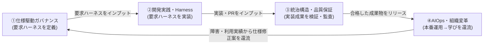

# エンタープライズAI駆動開発 研究ポイント整理と分科会テーマ提案

`CC研_運営/`（研究会の運営・進め方・To-Be資料）と`personal_doc/`（登壇資料サマリー）の内容を横断し、「エンタープライズ組織におけるAI駆動開発の導入」を研究する上で重要なポイントを整理し、4つの分科会テーマ案とその関係性を提案する。

参照元:
- [AI開発のToBe（2026年度初）.md](../CC研_運営/AI開発のToBe（2026年度初）.md)
- [AI駆動プロセスTobeとのギャップ.md](../CC研_運営/AI駆動プロセスTobeとのギャップ.md)
- [pre_study_homework.md](../CC研_運営/pre_study_homework.md)
- [研究の進め方.md](../CC研_運営/研究の進め方.md)
- [AI駆動開発が変える、大規模開発の前提.md](./AI駆動開発が変える、大規模開発の前提.md)（ビズリーチ外山氏）
- [AI駆動で進化する開発プロセス_クラスメソッドでの実践と成功事例.md](./AI駆動で進化する開発プロセス_クラスメソッドでの実践と成功事例.md)（クラスメソッド佐藤氏）

---

## 1. 研究上の重要ポイント整理

### (1) パラダイムの本質は「速度」ではなく「制御位置」の転換
HITL（Human in the Loop：人間がフロー内部で全判断点を通過する）から HOTL（Human on the Loop：人間はループ外から監督する）への移行が、AI駆動開発の核心である。ビズリーチ・クラスメソッド・CC研資料のいずれも共通してこの構造転換を主題としており、単なる「AIで速くなった」ではなく「人間がどこに立つか」「何を最適化対象にするか（個人 vs ループ構造）」が変わる点が最重要の前提認識になる。

### (2) Harness（実行基盤）は必要条件、統治（ガバナンス）は十分条件
Harness Engineering（実行環境・文脈・ガードレール・検証ループ・観測性の設計）は開発速度を劇的に高めるが、それだけでは「HITLの高速化」に留まり、人間は依然として律速点のままである（ビズリーチ資料）。真にHOTLへ到達するには、①ルールを定める（立法）②ルールへの適合を判定する（司法）③ルールに基づき実行する（行政）という3機能の構造的分離＝「統治」が必要。しかも**harnessは業界共通で「借りられる」が、統治（何が正しいか＝プロダクトドメイン依存、何をチェックすべきか＝フェーズ依存）は自社でしか構築できない**。これはエンタープライズが外部ツール導入だけでは差別化できない核心的理由になる。

### (3) 「書かれている」と「効いている」は別物
ADR・Wiki・設計書がいくら整備されていても、AIエージェントがそれを参照し、違反時に自動で停止・検知できる状態（Authority Provenance Graph / Specification Provenance Graph による機械可読な双方向接続）でなければ、実質的な統治として機能しない。SSOT（人が定義した正典）と派生データ（機械が自動生成する変更影響分析等）を混在させないことも同様に重要な設計原則。

### (4) アジャイルとウォーターフォールは対立ではなく補完関係
従来型アジャイル（ドキュメント省略）はAIにとってコンテキスト不足でハルシネーションを誘発し、従来型ウォーターフォール（人手の工程管理）はAIの実行速度を相殺する。上流でWaterfall的な厳密さ（要求ハーネスによる仕様の構造化）を担保しつつ、下流はAgile以上の高速ループ（自律実装・検証・デプロイ）で回す「ハイブリッド融合」が正解であり、Vibe Coding（雰囲気開発）とSDD（仕様駆動開発）を「Vibeでプロトタイプ→仕様を逆抽出→エンタープライズ制約を追加→SDDで本番構築」という4ステップで接続する型がエンタープライズには有効（クラスメソッド事例のRuleトレードオフ論とも整合）。

### (5) 生産性指標の転換
LOC（ステップ数）・人月工数といった「量」の指標は、AI時代にはむしろコード膨張やレビュー負荷増大を助長するリスクがある。PR数・デプロイ頻度・デグレ数という「価値提供の頻度と安全網の健全性」への指標転換、さらに「AI実行密度（人間の介入なしにAIが自律的に走り続けられる密度）」という新KPIが、組織のAI駆動成熟度を測る実証的な差別化要因になっている（ビズリーチの社内データで桁違いの差が実証済み）。

### (6) 新規開発と既存改修で戦略が異なる
新規開発は仕様が未確定なため「Vibe & SDDハイブリッド型」（プロトタイプ先行→仕様逆抽出）が有効。既存システム改修は仕様が属人化・暗黙知化しているため「Context & Harness型」（製品コンテキストの構造化＋多層自動検証の5ゲート）による防衛的アプローチが必要。エンタープライズの大規模開発では後者（レガシー資産の防衛）の比重が大きく、ここが導入の最大の障壁になりやすい。

### (7) Vibe Codingのリスクを正しく理解する
Vibe Codingは「70%問題」（非エンジニアでも70%までは驚くほど速いが、残り30%は労力をかけても進まない）や「居眠り運転現象」（高精度AIへの過信でチェックが手薄になり成績が19%低下）といった実証的リスクを抱える。1行の設定（`readonlyRootFilesystem: true`等）でも影響範囲の理解にはソフトウェアエンジニアリングの深い知識が要る、という点は「AIがあれば人間の理解は不要になる」という誤解への強い反証になる。

### (8) 発注者側・組織側の役割変化と定着の壁
発注者PMは「人月・進捗を管理する時間管理者」から「AIが検証可能な論理仕様を提示し、自動検証結果で検収する境界管理者（HOTL）」へ変わる必要がある。また、ツールを導入するだけでは定着しない（MS/Accentureの実証実験：研修ありは導入率69.4%、なしは24.4%）。個人スキルは「コード記述力」から「論理記述力・ハーネス設計力」へ、組織ロールとして「AIオーケストレーター（開発側）」「仕様（要求）アーキテクト（発注側）」の育成が必要になる。

---

## 2. 分科会テーマ提案（4テーマ）

`研究の進め方.md`が先行研究調査の観点として既に定義している**「4つの調査観点」**（実務プラクティス・開発者観点／アーキテクチャ・品質保証観点／プロダクトマネジメント・価値定義観点／組織ガバナンス・プロセス移行観点）は、そのまま4分科会の骨格として転用できる。これを、統治の三権分立モデル・AI-DLCの5プロセスと対応づけて具体化したのが以下の提案である。

### 分科会① 仕様駆動ガバナンス（要求定義・AI-Ready化）
- **対応する調査観点**: プロダクトマネジメント・価値定義観点
- **中核テーマ**: 要求ハーネス（Given-When-Then等）による仕様の構造化、USM→仕様への落とし込み、Vibe（認識合わせ）から仕様抽出への4ステップ、三権分立モデルにおける「立法（ルール）」と「憲法（Constitution）」の設計
- **問い**: 曖昧な日本語仕様書・ポンチ絵からの脱却をどう組織的に徹底するか。AI-Ready化のために発注者・PMは何を変える必要があるか。
- **参照資料**: `AI開発のToBe`3〜4節・11節、`ギャップ資料`プロセス①、`ビズリーチ資料`三権分立・憲法

### 分科会② 開発実践・Harness Engineering
- **対応する調査観点**: 実務プラクティス・開発者観点
- **中核テーマ**: Harness（実行環境・文脈・ガードレール・検証ループ・観測性）の設計実務、Cursor/Devin/Cline等ツールの使い分けとRule/Knowledge整備のトレードオフ、新規開発（Vibe→SDD）と既存改修（Context & Harness）の使い分け、Vibe Codingの適正利用とリスク
- **問い**: harnessは「借りられる」領域である一方、自社の開発実践としてどこまで作り込むべきか。Rule整備コストが正当化されるプロジェクト規模・恒常性の見極め方は。
- **参照資料**: `クラスメソッド資料`全体、`ビズリーチ資料`harness定義・必要条件

### 分科会③ 統治構造・品質保証（三権分立と多層検証）
- **対応する調査観点**: アーキテクチャ・品質保証観点
- **中核テーマ**: 司法AI（セマンティックチェック＋決定性チェック）の設計、多層自動検証ゲート（要求整合性・セキュリティ・品質・インフラ・サンドボックス）、Authority/Specification Provenance Graphによる「書かれている」から「効いている」への転換、SSOTと派生データの分離原則
- **問い**: 「立法なき司法」「司法なき立法」「越境司法」を自組織で機械的に検知する仕組みをどう作るか。セキュリティ・堅牢性・保守品質など機能以外の領域への統治の拡張は可能か。
- **参照資料**: `ビズリーチ資料`統治のGraph・SSOT原則、`ギャップ資料`プロセス③、`AI開発のToBe`12節

### 分科会④ AIOps・組織変革（運用還流とスキルシフト）
- **対応する調査観点**: 組織ガバナンス・プロセス移行観点
- **中核テーマ**: 本番運用監視から仕様への自律還流ループ（AIOps）、生産性指標の転換（PR数・デプロイ頻度・デグレ数・AI実行密度）、発注者PMの役割変化（時間管理者→境界管理者）、AIオーケストレーター／仕様アーキテクトという新ロールの育成、研修による定着率の実証データ
- **問い**: 本番障害から仕様修正への還流を、人手の伝言ゲームなしに実現するには何が必要か。組織のスキル・評価制度・研修設計をどうAI駆動前提に再設計するか。
- **参照資料**: `AI開発のToBe`13〜15節、`ギャップ資料`プロセス⑤・成熟度モデル、`クラスメソッド資料`研修の必要性

---

## 3. 4テーマの関係性（一本の線でつなぐストーリー）

`研究の進め方.md`が中間報告に求める「4分科会が一本の線（シナリオ）でつながっているストーリー」に対応させると、4テーマは**AI-DLCの自律還流ループそのもの**として円環的に接続する。

- **①→②**: 仕様駆動ガバナンスで定義された「要求ハーネス」が、開発実践・Harness Engineeringのインプットになる。
- **②→③**: Harnessを通じて自律生成された実装・PRが、統治構造・品質保証（三権分立の司法機能）による多層検証の対象になる。
- **③→④**: 検証をパスした成果物がリリースされ、AIOps・組織変革の運用監視フェーズに引き継がれる。
- **④→①**: 本番運用で得られた障害分析・利用実績が、仕様（要求ハーネス）の修正案として①へ自律的に還流し、ループが継続する。

このループは、まさに`AI開発のToBe`14節が定義する「一本のデータ・パイプライン」であり、`pre_study_homework.md`で既に候補として挙がっていたテーマA〜D（土台・AI-Ready化／WF進化／アジャイル進化／アーキテクチャ・Ops）とも以下のように対応する。

| 提案テーマ | pre_study候補テーマとの対応 | 補足 |
|---|---|---|
| ①仕様駆動ガバナンス | テーマA（土台・AI-Ready化）＋テーマC（アジャイル進化の上流側） | 仕様の構造化＝AI-Readyの核心 |
| ②開発実践・Harness Engineering | テーマC（アジャイル進化） | 高速な自律実行ループそのもの |
| ③統治構造・品質保証 | テーマB（WF進化） | 上流の厳密性・ガバナンスをHarness Engineeringとして再定義 |
| ④AIOps・組織変革 | テーマD（アーキテクチャ・Ops）＋組織・人材論点 | 運用監視と組織スキルシフトを統合 |

既存候補（A〜D）を単純に「開発工程の区分」として並べるのではなく、**統治の三権分立モデルとAI-DLCの自律還流ループという1本の理論的背骨**で結び直すことで、4分科会の個別報告が「バラバラの点」ではなく「価値が循環する一つのシステム」として説明できるようになる点が、この整理の狙いである。
