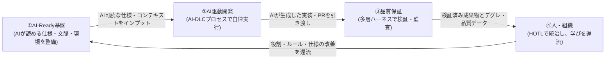

# 2026年度 研究会 分科会編成 全体構成と責任境界

本ドキュメントは、「エンタープライズ組織におけるAI駆動開発の実現・導入」を研究する本研究会の4分科会について、全体ストーリー・編成根拠・責任境界（重複排除ルール）を定義するものである。各分科会の研究概要とインセプションデッキは個別ファイルを参照。

参照元:
- [研究の進め方.md](../../CC研_運営/研究の進め方.md)
- [AI開発のToBe（2026年度初）.md](../../CC研_運営/AI開発のToBe（2026年度初）.md)
- [AI駆動プロセスTobeとのギャップ.md](../../CC研_運営/AI駆動プロセスTobeとのギャップ.md)
- [エンタープライズAI駆動開発_研究ポイント整理と分科会テーマ提案.md](../エンタープライズAI駆動開発_研究ポイント整理と分科会テーマ提案.md)
- [AI駆動開発が変える、大規模開発の前提.md](../AI駆動開発が変える、大規模開発の前提.md)（ビズリーチ）
- [AI駆動で進化する開発プロセス_クラスメソッドでの実践と成功事例.md](../AI駆動で進化する開発プロセス_クラスメソッドでの実践と成功事例.md)（クラスメソッド）

---

## 1. 研究会全体の目的

アジャイル／ウォーターフォールといった特定の手法論に依存せず、生成AIの進化を前提とした**「AI-Ready」化と「AI駆動開発（AI-DLC）」を軸に、エンタープライズ組織が次世代の開発・運用モデルをどのように実現し、段階的に導入していくか**を研究する。単発のPoCやツール導入で終わらせず、再現性のあるプロセス・成果物・運用指針として提言することをゴールとする。

## 2. 4分科会の編成

| # | 分科会 | 一言でいうと | 統治モデルとの対応 | インセプションデッキ |
|---|---|---|---|---|
| 1 | **AI-Ready基盤** | AIが正しく動くための「インプットと土台」を作る | 立法（ルール・仕様のSSOT） | [分科会1_AI-Ready基盤_インセプションデッキ.md](./分科会1_AI-Ready基盤_インセプションデッキ.md) |
| 2 | **AI駆動開発（開発プロセスの変化）** | WF/アジャイルからAI-DLCへの「プロセスの再設計」 | 行政（実行ループの設計） | [分科会2_AI駆動開発プロセス_インセプションデッキ.md](./分科会2_AI駆動開発プロセス_インセプションデッキ.md) |
| 3 | **品質保証** | AI生成物を機械的に検証する「安全網」を作り、実機で検証する | 司法（検証・監査） | [分科会3_品質保証_インセプションデッキ.md](./分科会3_品質保証_インセプションデッキ.md) |
| 4 | **人・組織の在り方** | HOTL前提の「役割・スキル・組織」を再設計する | 統治機構の運営者（憲法の承認者） | [分科会4_人と組織_インセプションデッキ.md](./分科会4_人と組織_インセプションデッキ.md) |

### 編成の根拠

ビズリーチ資料の「AI統治の三権分立」モデル（立法＝ルール定義／司法＝検証／行政＝実行）と、`AI開発のToBe`14節の「一本のデータ・パイプライン」（要求定義→自律開発→多層検証→承認→運用還流）を骨格とする。harness（実行基盤）は業界共通で「借りられる」が、統治（何が正しいか・何をチェックすべきか）は自社でしか作れない——というエンタープライズ導入の核心的課題を、4つの視点から分担して解明する編成である。

## 3. 分科会を「一本の線」でつなぐストーリー

- **①→②**: AI-Ready基盤が整備した「実行可能仕様（要求ハーネス）・コンテキスト・実行環境」をインプットに、AI駆動プロセスが自律実行ループを回す。
- **②→③**: プロセスが生み出す大量の実装・PRを、品質保証の多層検証ハーネスが機械的に検証する。
- **③→④**: 検証で得られた品質データ（デグレ数・検出率）が、人・組織の役割設計や統治の実効性評価の材料になる。
- **④→①**: 組織が承認したルール・仕様の改善が、再びAI-Ready基盤（SSOT）へ還流し、ループが継続する。

## 4. 責任境界マトリクス（重複排除ルール）

複数の分科会にまたがって見えるトピックについて、「どの分科会が主担当か」を以下の通り定義する。**各分科会は他分科会の主担当領域を研究スコープに含めない**（連携インターフェースとしての言及は可）。

| 紛らわしいトピック | 主担当 | 境界の考え方 |
|---|---|---|
| 要求ハーネス（実行可能仕様）の**記述標準・フォーマット** | ①AI-Ready基盤 | 「AIに何を読ませるか」はインプット側の問題 |
| 要求ハーネスを**開発工程のどこで誰が作るか** | ②AI駆動開発 | 工程・フローの設計はプロセス側の問題 |
| 要求ハーネスと**テストの整合性検証（要求整合性ゲート）** | ③品質保証 | 「合っているか裁く」のは検証側の問題 |
| 要求ハーネスを**書ける人材の育成** | ④人・組織 | スキル・ロールの問題 |
| コンテキストハーネス（用語集・ADR・ドメイン知識）の整備 | ①AI-Ready基盤 | SSOT・立法側 |
| 検証ハーネス（自動テスト・品質ゲート）・実行ハーネス（サンドボックス検証） | ③品質保証 | 司法側。実機検証もここが実施 |
| Vibe→SDDの4ステップ、新規/既存改修のアプローチ使い分け | ②AI駆動開発 | プロセスパターンの問題 |
| 生産性指標（PR数・デプロイ頻度・AI実行密度） | ②AI駆動開発 | プロセスの効果測定 |
| 品質指標（デグレ数・欠陥検出率・カバレッジ・偽陽性率） | ③品質保証 | 安全網の実効性測定 |
| 導入・定着指標（利用率・研修効果・ロール充足度） | ④人・組織 | 組織変革の効果測定 |
| AIOps（運用監視・自律修復）の**パイプライン基盤** | ①AI-Ready基盤 | データ・パイプラインの土台として扱う |
| AIOpsの**還流をプロセスに組み込む方法** | ②AI駆動開発 | 開発ループの一部として扱う |
| 発注者PM・エンジニアの役割変化、契約・検収の転換 | ④人・組織 | 人と組織構造の問題 |
| セキュリティ**基盤**（データ暗号化・モデルアクセス統制・コスト管理） | ①AI-Ready基盤 | プラットフォームの問題 |
| セキュリティ**検証**（SAST/DAST・脆弱性スキャンゲート） | ③品質保証 | 検証ゲートの問題 |

## 5. 年間マイルストーン（全分科会共通）

`研究の進め方.md`のスケジュールに従う。

- **7月**: 夏合宿（7/10-11）でテーマ確定、インセプションデッキ完成 ← 本ドキュメント群
- **8〜9月**: 先行研究調査（先行研究整理マトリクスに整理）、中間報告資料作成（9月下旬提出）
- **10月**: 中間報告会（10/2）、検証開始（PoC・ヒアリング）
- **11月**: 秋合宿（11/6-7）で最終発表シナリオ検討、11月末までに主要調査完了
- **12〜2月**: 最終報告書執筆・相互レビュー・最終発表PPT提出
- **3月上旬**: 最終報告会
